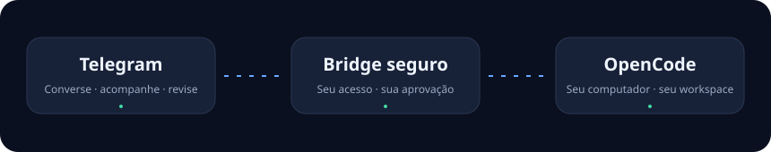
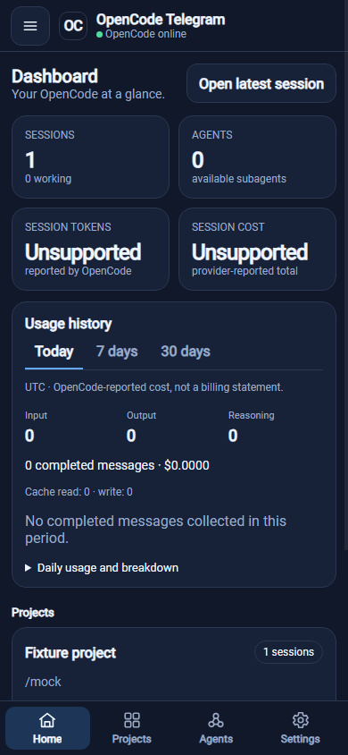
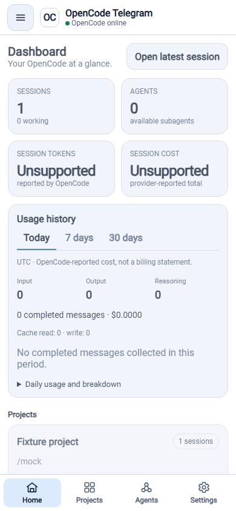

<p align="center"></p>

# OpenCode Telegram

[English](#english) · [Português](#português) · [Español](#español)

## English

**Your computer works. You stay in control from Telegram.**

Take OpenCode with you: chat with your agents, choose models, follow live activity and review results on your phone or desktop. Connected to your workspace, without exposing the OpenCode server to the internet.

Self-hosted · single owner · MIT · **beta**

### From request to result

- **Chat and follow along.** Streaming responses, model and agent selection, reasoning effort controls.
- **Review the work.** Diffs, tool activity, attachments, workspace files and an artifact gallery.
- **Find your integrations.** Skills, MCP servers, plugins and providers reported by OpenCode.
- **Keep control.** Explicit approvals, trusted devices and independent recovery.
- **Make it yours.** Light/dark/system themes and automatic English, Portuguese, Spanish, Chinese, French and Hindi. Model output, file names and integration names are not translated.

### One interface, two themes

Actual application screenshots with **fictional test data**, not private conversations or credentials.

| Dark | Light |
| --- | --- |
|  |  |

### Get started

Choose **[native Windows (PowerShell, no WSL)](docs/en/windows-native.md)** or Linux/WSL below. Run OpenCode and the Bridge in the same environment. Do not share `node_modules` between Windows and WSL.

Requirements: **Node.js 22+, OpenCode, a Telegram bot and an HTTPS URL** pointing only to the Bridge. Your computer must remain powered on and connected.

```bash
git clone https://github.com/SanNw/opencode-telegram.git
cd opencode-telegram
npm ci
cp .env.example .env
```

Set `TELEGRAM_BOT_TOKEN`, `TELEGRAM_OWNER_ID`, `TELEGRAM_MINI_APP_URL` and an authorized folder in `OPENCODE_DIRECTORY`. Configure the matching credentials if OpenCode requires authentication. **Never publish `.env`.**

```bash
npm run build
# Terminal 1
opencode serve --hostname 127.0.0.1 --port 4096
# Terminal 2, in the repository folder
npm start
```

Forward your HTTPS URL to `http://localhost:8787`, configure the Mini App button in BotFather and open it inside Telegram. Pair using the one-time code printed in the Bridge terminal. Never expose the OpenCode or Vite ports.

**[Detailed installation](docs/en/installation.md)** · [Security](docs/en/security.md) · [Operations and backup](docs/en/operations.md)

### Beta boundaries

- Single owner, not multi-user. OpenCode and the Bridge bind to loopback.
- Skills/plugins are read-only in the tested contract; MCP changes are runtime-only.
- This beta is not a security certification. Physical acceptance and independent review are still required.
- Docker is optional and validated only on Linux. Windows/macOS container hosts are not validated.

### Development

```bash
npm run check
npm test
npm run build
npm run test:runtime
CHROME_BINARY=/path/to/chrome npm run test:browser
```

[Browser tests](docs/browser-validation.md) · [Telegram acceptance](docs/telegram-acceptance.md) · [Specification](PROJECT_SPEC.md) · [MIT license](LICENSE)

## Português

**Seu computador trabalha. Você acompanha pelo Telegram.**

Leve o OpenCode no bolso: converse com seus agentes, escolha modelos, acompanhe a atividade e revise os resultados pelo celular ou desktop. Tudo conectado à sua pasta de trabalho, sem publicar o servidor OpenCode na internet.

Hospedagem própria · proprietário único · MIT · **beta**

### Do pedido ao resultado

- **Converse e acompanhe.** Respostas em tempo real, seleção de modelos, agentes e esforço de raciocínio.
- **Veja o que mudou.** Diffs, atividade das ferramentas, anexos, arquivos e galeria de artefatos.
- **Encontre suas integrações.** Skills, MCPs, plugins e provedores informados pelo OpenCode.
- **Mantenha o controle.** Aprovação explícita, dispositivos confiáveis e recuperação independente.
- **Use do seu jeito.** Temas claro/escuro/sistema e idioma automático nos seis idiomas. Respostas dos modelos, nomes de arquivos e integrações não são traduzidos.

As capturas acima mostram os dois temas com **dados fictícios de teste**, sem conversas ou credenciais pessoais.

### Instalação

Escolha **[Windows nativo (PowerShell, sem WSL)](docs/pt/windows-native.md)** ou Linux/WSL. OpenCode e Bridge devem rodar no mesmo ambiente; não reutilize `node_modules` entre Windows e WSL.

Requisitos: **Node.js 22+, OpenCode, bot do Telegram e URL HTTPS** apontando somente para o Bridge. O computador precisa permanecer ligado e conectado.

```bash
git clone https://github.com/SanNw/opencode-telegram.git
cd opencode-telegram
npm ci
cp .env.example .env
```

Edite `.env`: `TELEGRAM_BOT_TOKEN`, `TELEGRAM_OWNER_ID`, `TELEGRAM_MINI_APP_URL` e uma pasta autorizada em `OPENCODE_DIRECTORY`. Configure as credenciais correspondentes se o OpenCode exigir autenticação. **Nunca publique `.env`.**

```bash
npm run build
# Terminal 1
opencode serve --hostname 127.0.0.1 --port 4096
# Terminal 2, na pasta do repositório
npm start
```

Encaminhe sua URL HTTPS para `http://localhost:8787`, configure o botão do Mini App no BotFather e abra pelo Telegram. Pareie com o código de uso único mostrado no terminal do Bridge. Não publique a porta do OpenCode nem a do Vite.

**[Instalação detalhada](docs/pt/installation.md)** · [Segurança](docs/pt/security.md) · [Operação e backup](docs/pt/operations.md)

### Limites da beta

- Não é multiusuário. OpenCode e Bridge permanecem em loopback.
- Skills/plugins são somente leitura no contrato testado; mudanças de MCP valem somente durante a execução.
- A beta não é uma certificação de segurança. Aceitação física e revisão independente continuam necessárias.
- Docker é opcional, validado apenas em Linux. Windows/macOS não são hosts de contêiner validados.

### Desenvolvimento

```bash
npm run check
npm test
npm run build
npm run test:runtime
CHROME_BINARY=/caminho/para/chrome npm run test:browser
```

[Instalação](docs/pt/installation.md) · [Segurança](docs/pt/security.md) · [Operação e cópias de segurança](docs/pt/operations.md) · [Licença MIT — texto original em inglês](LICENSE)

## Español

**Tu ordenador trabaja. Tú mantienes el control desde Telegram.**

Lleva OpenCode contigo: conversa con tus agentes, elige modelos, sigue la actividad y revisa resultados desde el móvil o el escritorio. Conectado a tu espacio de trabajo, sin exponer el servidor OpenCode a internet.

Autohospedado · un solo propietario · MIT · **beta**

### De la petición al resultado

- **Conversa y sigue el progreso.** Respuestas en tiempo real, selección de modelos y agentes, controles de esfuerzo de razonamiento.
- **Revisa el trabajo.** Diffs, actividad de herramientas, adjuntos, archivos y galería de artefactos.
- **Encuentra tus integraciones.** Skills, servidores MCP, plugins y proveedores informados por OpenCode.
- **Mantén el control.** Aprobación explícita, dispositivos de confianza y recuperación independiente.
- **Adáptalo a ti.** Temas claro/oscuro/sistema e idioma automático en los seis idiomas. Las respuestas de los modelos y los nombres de archivos e integraciones no se traducen.

Las capturas anteriores muestran ambos temas con **datos ficticios de prueba**, sin conversaciones ni credenciales personales.

### Instalación

Elige **[Windows nativo (PowerShell, sin WSL)](docs/es/windows-native.md)** o Linux/WSL. OpenCode y el Bridge deben ejecutarse en el mismo entorno; no compartas `node_modules` entre Windows y WSL.

Requisitos: **Node.js 22+, OpenCode, un bot de Telegram y una URL HTTPS** que apunte únicamente al Bridge. El ordenador debe permanecer encendido y conectado.

```bash
git clone https://github.com/SanNw/opencode-telegram.git
cd opencode-telegram
npm ci
cp .env.example .env
```

Configura en `.env`: `TELEGRAM_BOT_TOKEN`, `TELEGRAM_OWNER_ID`, `TELEGRAM_MINI_APP_URL` y una carpeta autorizada en `OPENCODE_DIRECTORY`. Añade las credenciales correspondientes si OpenCode requiere autenticación. **Nunca publiques `.env`.**

```bash
npm run build
# Terminal 1
opencode serve --hostname 127.0.0.1 --port 4096
# Terminal 2, en la carpeta del repositorio
npm start
```

Dirige tu URL HTTPS a `http://localhost:8787`, configura el botón del Mini App en BotFather y ábrelo dentro de Telegram. Vincula el dispositivo con el código de un solo uso mostrado en el terminal del Bridge. No expongas los puertos de OpenCode ni de Vite.

**[Instalación detallada](docs/es/installation.md)** · [Seguridad](docs/es/security.md) · [Operación y copias de seguridad](docs/es/operations.md)

### Límites de la beta

- No es multiusuario. OpenCode y el Bridge permanecen en loopback.
- Skills/plugins son de solo lectura en el contrato probado; los cambios MCP son solo de ejecución.
- La beta no es una certificación de seguridad. Aún se requieren aceptación física y revisión independiente.
- Docker es opcional y está validado solo en Linux. Los hosts de contenedores Windows/macOS no están validados.

### Desarrollo

```bash
npm run check
npm test
npm run build
npm run test:runtime
CHROME_BINARY=/ruta/a/chrome npm run test:browser
```

[Instalación](docs/es/installation.md) · [Seguridad](docs/es/security.md) · [Operación y copias de seguridad](docs/es/operations.md) · [Licencia MIT — texto original en inglés](LICENSE)
